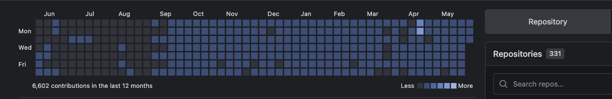
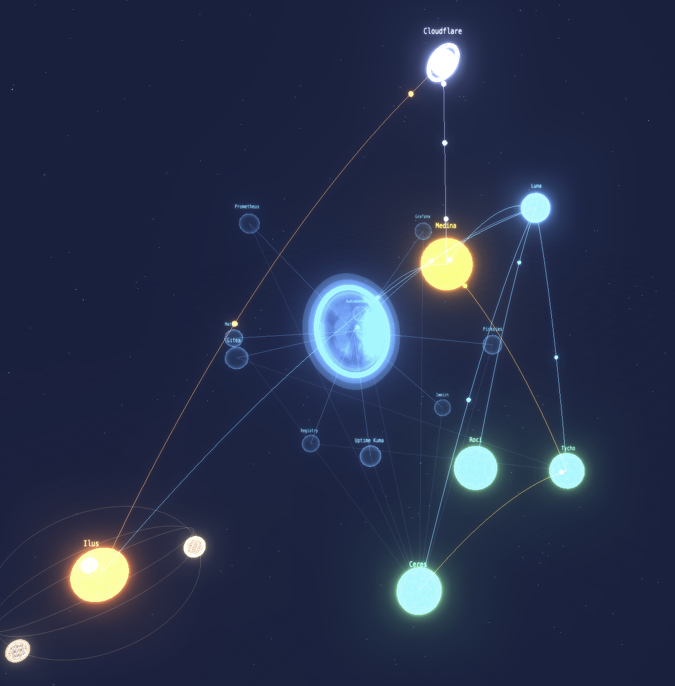

**AI Engineer** building production agent systems, clinical AI workflows, and self-hosted infrastructure.
Primary dev activity on [self-hosted Gitea](https://gitea.yourai.sh) — 6,600+ contributions in the last 12 months.

  

  

---

## 🧠 Interests

**Neurotech & BCI**
Experimented with EEG development (Emotiv headset). Following advances in neural signal processing and brain-computer interfaces.

**Healthtech**
Built production clinical AI workflows — the gap between a promising LLM demo and something a clinical team relies on daily is mostly engineering.

---

## 🏆 Certifications

  
  
  

